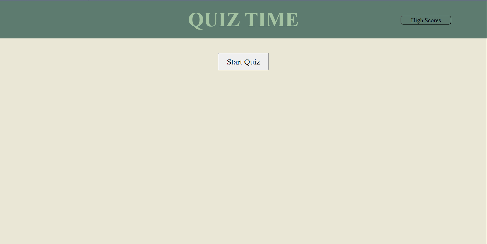

# Challenge-4-Quiz-Time

Quiz that takes all current techniques to create.

## Description

Defenitily the greatest undertaking I've done thus far. I was able to create a quiz that has the capability to calculate score and time the whole process. It also can grab local storage items inorder to provide proper scores.

## Installation/ Deployed Page

https://github.com/B-R-Ls/Quiz-Time
https://b-r-ls.github.io/Quiz-Time/index.html

## Usage

It test the user on a few JavaScript Questions. Once answered it will ask your initials before adding them with your score for the highscore page.

##Credits

N/A

## License

MIT License